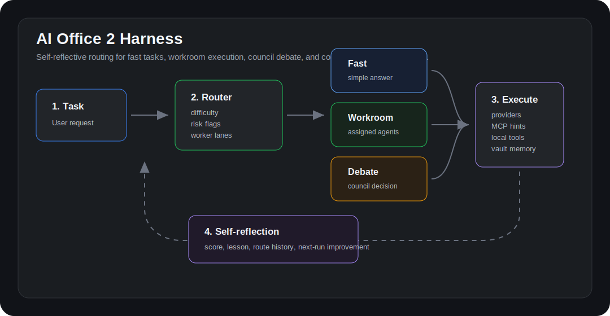

# AI Office 2 Harness Guide

AI Office 2 now includes a lightweight agent harness layer inspired by modern agent workbenches. It does not try to copy any one project. Instead, it adds practical routing, connector awareness, and self-reflection on top of the existing chat, council, workroom, MCP, and vault features.



## What changed

- **Task difficulty routing**: each request is classified as `trivial`, `simple`, `standard`, `complex`, or `critical`.
- **Execution route selection**: the app chooses `fast`, `direct`, `workroom`, or `debate`.
- **Worker lane inference**: requests are mapped to likely lanes such as `developer`, `researcher`, `writer`, and `analyst`.
- **Connector hints**: the harness recommends MCP-like surfaces such as browser, GitHub, calendar, filesystem, and memory vault.
- **Self-reflection**: completed runs store a local lesson, score, route, and difficulty so the app can show how it is improving.
- **Harness dashboard**: the new sidebar item **하네스** previews routing decisions and shows reflection history.

## Where to find it

1. Start the app.
2. Open the left sidebar.
3. Click **하네스**.
4. Paste a task into the Task router preview.
5. Check the selected route, difficulty, connector matches, and reflection stats.

The normal chat flow also uses the harness automatically:

- **전체 대화**: the harness decides whether to answer fast, send work to the workroom, or open a council debate.
- **업무 대화**: work is routed directly to the inferred worker lanes.
- **회의 대화**: complex or high-risk tasks use the existing council flow.

## Routes

| Route | When it is used | What happens |
| --- | --- | --- |
| `fast` | Very short or explicitly quick tasks | CEO answers directly with minimal overhead |
| `direct` | Clear single-lane tasks | The task is sent to the relevant worker without council debate |
| `workroom` | Multi-lane execution tasks | The workroom receives a visible work order and agents execute by lane |
| `debate` | Complex, risky, architecture, security, automation, or explicit debate tasks | CEO asks commander agents for opinions, decides, then sends execution work |

## Example prompts

### Fast route

```text
오늘 할 일 우선순위만 간단히 정리해줘
```

Expected behavior:

- Route: `fast`
- No council debate
- Short direct answer

### Direct or workroom route

```text
README에 설치 방법과 예시 사용법을 정리해줘
```

Expected behavior:

- Route: `direct` or `workroom`
- Worker lanes: usually `writer`, sometimes `developer`
- A work order appears in the workroom when launched from 전체 대화

### Debate route

```text
MCP와 GitHub를 연결해서 자동 PR 리뷰 하네스를 설계하고 구현해줘
```

Expected behavior:

- Route: `debate`
- Connector hint: GitHub connector
- Worker lanes: developer plus supporting lanes
- Council debate before execution

### Connector-heavy automation

```text
브라우저로 경쟁사 페이지를 확인하고 스크린샷 기반으로 개선안을 만들어줘
```

Expected behavior:

- Connector hint: Browser automation
- Worker lanes: researcher and writer
- If the task becomes complex, it may move from workroom to debate

## MCP and connector setup

The harness does not install every connector automatically. It recommends likely surfaces, then you can manage them in **도구 관리자**.

1. Open **도구 관리자**.
2. Use the **MCP 서버** tab.
3. Add or enable the server you need.
4. Restart the host app that consumes the MCP config if required.

Useful connector categories:

- **Filesystem tools**: already available through the Electron safety harness.
- **Memory vault**: already available for local long-term memory and run archives.
- **Browser automation**: useful for screenshots, web UI checks, and login flows.
- **GitHub connector**: useful for issues, PR review, CI triage, and release tasks.
- **Calendar connector**: useful for schedules, meeting prep, and daily briefs.

## Self-reflection

After non-trivial runs, AI Office 2 stores a local reflection record:

- task preview
- selected route
- difficulty
- worker lanes
- score
- lessons for next time

These records stay local in browser/Electron storage under `ao2-harness-reflections-v1`. The dashboard shows recent runs and aggregate lessons. This is intentionally lightweight: it gives the app a practical growth loop without making hidden autonomous changes.

## Development notes

Important files:

- `src/harness/router.ts`: task classification, route selection, and worker inference
- `src/harness/connectors.ts`: connector catalog and matching
- `src/harness/reflection.ts`: local self-reflection storage and scoring
- `src/components/Dashboard/HarnessDashboard.tsx`: dashboard UI
- `src/contexts/ChatContext.tsx`: chat/workroom/council integration
- `tests/harness/router.test.ts`: regression tests for routing and reflection

Verification commands:

```bash
npm test
npm run build
npm audit --json
git diff --check
```

## Current limitations

- The routing rules are deterministic heuristics, not a trained classifier.
- Connector recommendations do not guarantee that a connector is installed.
- Reflection is local and lightweight; it does not rewrite agent prompts by itself.
- Visual browser smoke tests require a browser automation dependency in the local verification environment.
